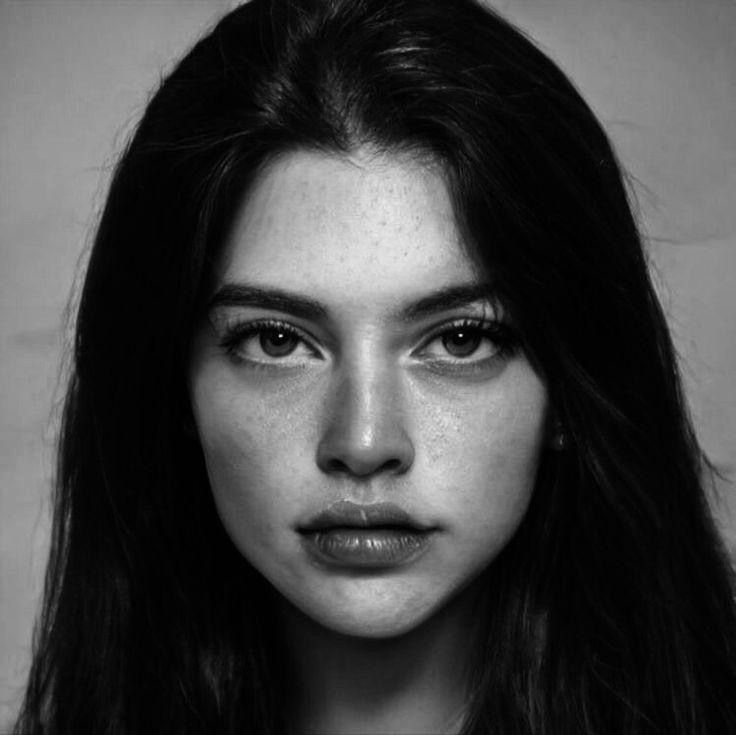
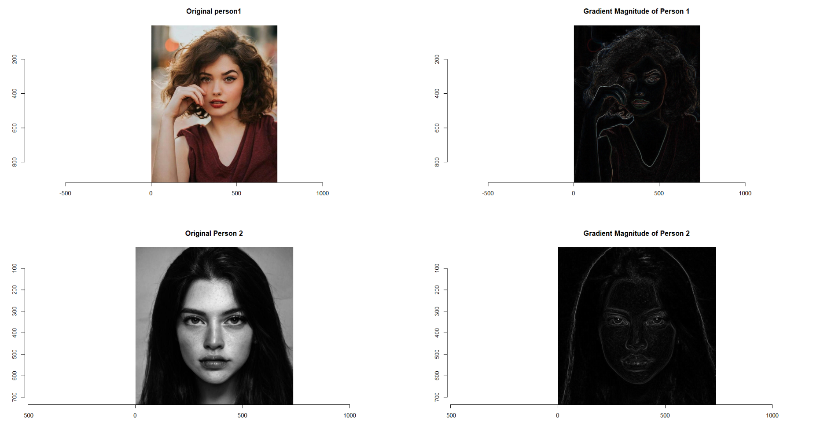
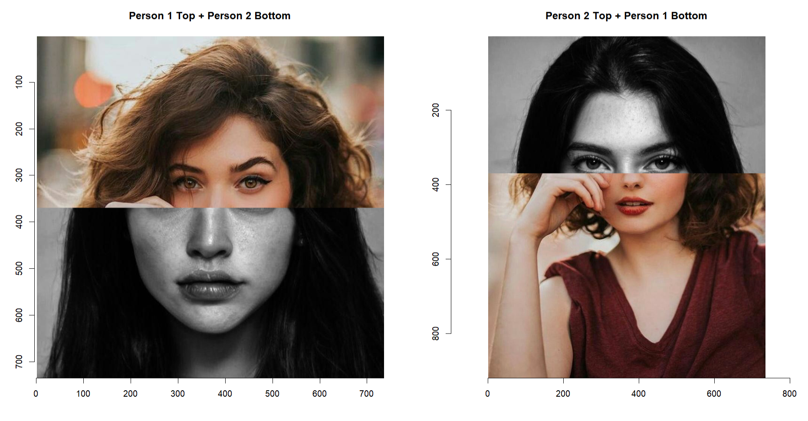
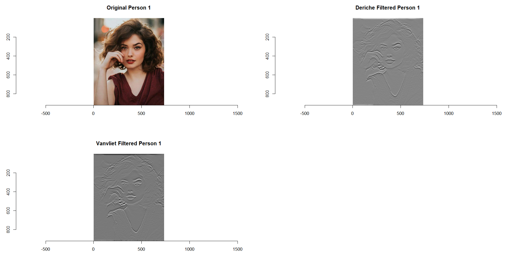
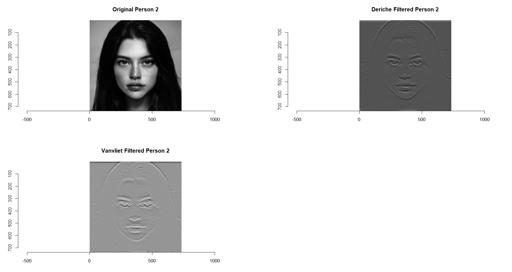
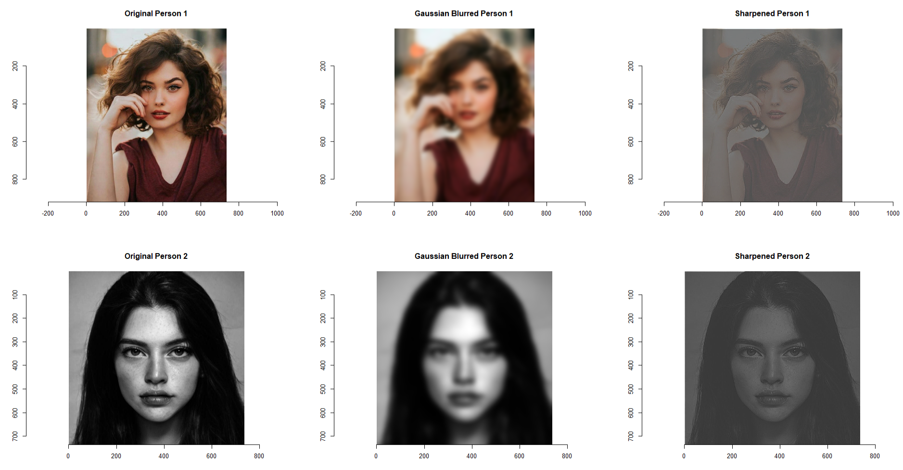
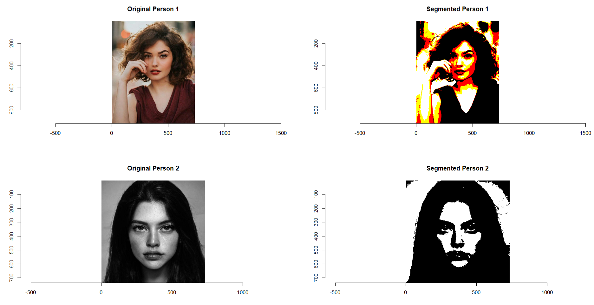
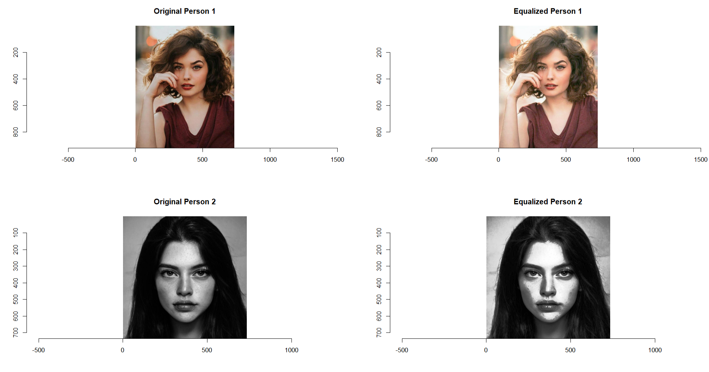

# <div align="center">📸 Image Analysis Using R and Imager 📸</div>

Welcome to the Image Analysis repository! This project demonstrates various image processing techniques using the imager package in R. The main focus is on analyzing two specific images (Person1.jpg and Person2.jpg) with a series of image processing tasks including edge detection, image splitting and concatenating, filtering, blurring and sharpening, segmentation, histogram equalization, and morphological operations.

## Table of Contents

- [Introduction](#introduction)
- [Getting Started](#getting-started)
- [Image Analysis Techniques](#image-analysis-techniques)
  - [Edge Detection](#edge-detection)
  - [Splitting & Concatenating Image](#splitting--concatenating-image)
  - [Filtering Image](#filtering-image)
  - [Blurry & Sharpen](#blurry--sharpen)
  - [Segmentation](#segmentation)
  - [Histogram Equalization](#histogram-equalization)
  - [Morphological Operations](#morphological-operations)
- [Conclusion](#conclusion)

## Introduction

This project is part of an assignment for the course STQD6114 Unstructured Data. It involves analyzing two images using various image processing techniques. The goal is to apply these techniques and visualize the results to understand their effects on the images.

## Getting Started

### Prerequisites

- R (version 4.0 or higher)
- RStudio (optional, but recommended)
- `imager` package

### Installation

1. Install R from [CRAN](https://cran.r-project.org/).
2. Install RStudio from [RStudio](https://www.rstudio.com/).
3. Install the `imager` package by running the following command in R:

   ```R
   install.packages("imager")

## Image Analysis Techniques

- ### Original Images

### 1.  Person 1


### 2.  Person 2



- ### Edge Detection

Edge detection is used to identify the boundaries within an image. This is achieved by computing image gradients and plotting the gradient magnitudes.

```R
# i. Edge detection

# Compute image gradients
grad_person1 <- imgradient(person1, "xy")
grad_person2 <- imgradient(person2, "xy")

# Compute gradient magnitude
grad_mag_person1 <- sqrt(grad_person1$x^2 + grad_person1$y^2)
grad_mag_person2 <- sqrt(grad_person2$x^2 + grad_person2$y^2)

# Plot the original and gradient magnitude images
par(mfrow = c(2, 2))
plot(person1, main = "Original person1")
plot(grad_mag_person1, main = "Gradient Magnitude of Person 1")

plot(person2, main = "Original Person 2")
plot(grad_mag_person2, main = "Gradient Magnitude of Person 2")
```


- ### Splitting & Concatenating Image

The images are split into top and bottom halves. These halves are then concatenated in different combinations to create new images.

```R
# ii. Splitting & concatenating image

# Get dimensions
height1 <- dim(person1)[1]
width1 <- dim(person1)[2]
height2 <- dim(person2)[1]
width2 <- dim(person2)[2]

# Split person1
person1_top <- subim(person1, y <= height1 / 2)
person1_bottom <- subim(person1, y > height1 / 2)

# Split person2
person2_top <- subim(person2, y <= height2 / 2)
person2_bottom <- subim(person2, y > height2 / 2)

# Concatenate the segments
# Here we concatenate the top half of person1 with the bottom half of person2 and vice versa
concat_image1 <- imappend(list(person1_top, person2_bottom), axis = "y")
concat_image2 <- imappend(list(person2_top, person1_bottom), axis = "y")

# Plot the concatenated images
par(mfrow = c(1, 2))
plot(concat_image1, main = "Person 1 Top + Person 2 Bottom")
plot(concat_image2, main = "Person 2 Top + Person 1 Bottom")
```


- ### Filtering Image

Filtering involves applying specific filters to the images to enhance or extract particular features. Here, Deriche and Vanvliet filters are applied to grayscale images.

```R
# iii. Filtering image

# Convert images to grayscale
person1_gray <- grayscale(person1)
person2_gray <- grayscale(person2)

# Apply Deriche and Vanvliet filters
deriche_person1 <- deriche(person1_gray, sigma = 4, order = 2, axis = "y")
vanvliet_person1 <- vanvliet(person1_gray, sigma = 4, order = 2, axis = "y")

deriche_person2 <- deriche(person2_gray, sigma = 4, order = 2, axis = "y")
vanvliet_person2 <- vanvliet(person2_gray, sigma = 4, order = 2, axis = "y")

# Plot the original and filtered images
par(mfrow = c(2, 2))
plot(person1, main = "Original Person 1")
plot(deriche_person1, main = "Deriche Filtered Person 1")
plot(vanvliet_person1, main = "Vanvliet Filtered Person 1")

par(mfrow = c(2, 2))
plot(person2, main = "Original Person 2")
plot(deriche_person2, main = "Deriche Filtered Person 2")
plot(vanvliet_person2, main = "Vanvliet Filtered Person 2")
```

##############


- ### Blurry & Sharpen

Blurring and sharpening are used to smoothen and enhance image details, respectively. Gaussian blur is applied for noticeable blurring, and a sharpening kernel is used to enhance the details.

```R
# iv. Blurry & sharpen

# Apply Gaussian filter with increased sigma for noticeable blurring
gaussian_person1 <- isoblur(person1, sigma = 10)
gaussian_person2 <- isoblur(person2, sigma = 10)

# Define a sharpening kernel
sharpening_kernel <- array(c(-1, -1, -1,
                             -1,  9, -1,
                             -1, -1, -1), c(3, 3, 1, 1))

# Apply sharpening filter using convolve function
sharpen_person1 <- imager::convolve(person1, sharpening_kernel)
sharpen_person2 <- imager::convolve(person2, sharpening_kernel)

# Plot the original, blurred, and sharpened images
par(mfrow = c(2, 3))
plot(person1, main = "Original Person 1")
plot(gaussian_person1, main = "Gaussian Blurred Person 1")
plot(sharpen_person1, main = "Sharpened Person 1")

plot(person2, main = "Original Person 2")
plot(gaussian_person2, main = "Gaussian Blurred Person 2")
plot(sharpen_person2, main = "Sharpened Person 2")
```


- ### Segmentation

Segmentation is the process of partitioning an image into distinct regions. Thresholding is used for this purpose, creating binary segmented images.

```R
# v. Segmentation

# Apply thresholding for segmentation
threshold <- 0.5
segmented_person1 <- person1 > threshold
segmented_person2 <- person2 > threshold

# Plot the original and segmented images
par(mfrow = c(2, 2))
plot(person1, main = "Original Person 1")
plot(segmented_person1, main = "Segmented Person 1")

plot(person2, main = "Original Person 2")
plot(segmented_person2, main = "Segmented Person 2")
```

- ### Histogram Equalization

Histogram equalization improves the contrast of images. This technique spreads out the most frequent intensity values, enhancing the visibility of details.

```R
# Histogram Equalization

# Function for histogram equalization
hist_equalize <- function(image) {
  hist <- hist(image, plot = FALSE)$counts
  cdf <- cumsum(hist) / sum(hist)
  equalized <- as.numeric(approx(x = seq(0, 1, length.out = length(hist)), y = cdf, xout = image)$y)
  dim(equalized) <- dim(image)
  return(as.cimg(equalized))
}

# Perform histogram equalization
person1_eq <- hist_equalize(person1)
person2_eq <- hist_equalize(person2)

# Plot the original and equalized images
par(mfrow = c(2, 2))

plot(person1, main = "Original Person 1")
plot(person1_eq, main = "Equalized Person 1")

plot(person2, main = "Original Person 2")
plot(person2_eq, main = "Equalized Person 2")

```

- ### Morphological Operations

Morphological operations like erosion, dilation, opening, and closing are used to modify the shapes within an image. These operations are applied using a disk-shaped structuring element.

```R
# vii. Morphological operations

# Convert to grayscale
#person1_gray <- grayscale(person1)
#person2_gray <- grayscale(person2)

# Define the structuring element (disk shape)
selem <- imfill(11, 11, val = 1) %>% as.cimg() %>% dilate_square(5)

# Apply erosion
eroded_person1 <- erode(person1, selem)
eroded_person2 <- erode(person2, selem)

# Apply dilation
dilated_person1 <- dilate(person1, selem)
dilated_person2 <- dilate(person2, selem)

# Apply opening
opened_person1 <- erode(person1, selem) %>% dilate(selem)
opened_person2 <- erode(person2, selem) %>% dilate(selem)

# Apply closing
closed_person1 <- dilate(person1, selem) %>% erode(selem)
closed_person2 <- dilate(person2, selem) %>% erode(selem)

# Plotting the results
par(mfrow = c(1, 2))
plot(person1, main = "Original Person 1")
plot(eroded_person1, main = "Eroded Person 1")

par(mfrow = c(1, 2))
plot(person2, main = "Original Person 2")
plot(eroded_person2, main = "Eroded Person 2")

par(mfrow = c(1, 2))
plot(person1, main = "Original Person 1")
plot(dilated_person1, main = "Dilated Person 1")

par(mfrow = c(1, 2))
plot(person2, main = "Original Person 2")
plot(dilated_person2, main = "Dilated Person 2")

par(mfrow = c(1, 2))
plot(person1, main = "Original Person 1")
plot(opened_person1, main = "Opened Person 1")

par(mfrow = c(1, 2))
plot(person2, main = "Original Person 2")
plot(opened_person2, main = "Opened Person 2")

par(mfrow = c(1, 2))
plot(person1, main = "Original Person 1")
plot(closed_person1, main = "Closed Person 1")

par(mfrow = c(1, 2))
plot(person2, main = "Original Person 2")
plot(closed_person2, main = "Closed Person 2")
```

## **Conclusion**

This project demonstrates a comprehensive application of image processing techniques using R and the imager package. By analyzing the results, we can gain insights into how these techniques transform and enhance images.

# <div align="center">Enjoy 👍</div>
